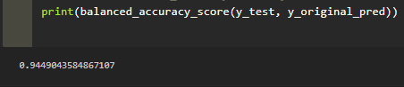

# Welcome to the Creditworthiness Machine-Learning (ML) Model!<a id="Top-of-Page">
***
## Cotents<a id="Contents">
[Overview of Analysis](#Overview-of-Analysis) 
 - [Purpose of Analysis](#Overview-of-Analysis_Purpose-of-Analysis) 
 - [Applied Financial Dataset](#Overview-of-Analysis_Applied-Financial-Dataset) 
 - [Sampling Methods](#Overview-of-Analysis_Sampling-Methods) 
 - [Quantifying Values and Reports](#Overview-of-Analysis_Quantifying-Values-and-Reports) 
 - [Applied Supervised ML Methods](#Overview-of-Analysis_Applied-Supervised-ML-Methods) 
 - [Summary of ML Methods Used](#Overview-of-Analysis_Summary-of-ML-Methods-Used) 

[Results](#Results) 
[Summary](#Summary) 
[Project Layout](#Project-Layout) 
[Technologies and Resources](#Technologies-Resources) 
[Installation Guide](#Installation-Guide) 
[Contributors](#Contributors) 
[License](#License) 
[Bottom of Page](#Bottom-of-Page) 

***
## Overview of Analysis<a id="Overview-of-Analysis">
#### Purpose of Anaylsis<a id="Overview-of-Analysis_Purpose-of-Analysis">
This project applies supervised ML training and resampling algorithms to build an effective, accurate regression model for detecting both healthy and, the more scarce, high-risk loans (i.e., the loan status). 

#### Applied Financial Dataset<a id="Overview-of-Analysis_Applied-Financial-Dataset">
Using supervised ML, this project utilizes a dataset of historical lending activiity from a peer-to-peer lending service to **model-fit-predict-evaluate**. The lending activity used includes the following information: 
 - **Loan Size**: The size of the loan
 - **Interest Rate**: The applied interest rate on the loan
 - **Borrower Income**: The borrower's annual income
 - **Debt-to-Income**: The borrower's debt-to-income ratio (DTI)
 - **Number of Account**: The borrower's total number of lending accounts
 - **Derogatory Marks**: The borrower's total number of derogatory marks on their credit score
 - **Total Debt**: The borrower's total amount of debt owed
 - **Loan Status**: The status of the borrower's loan ("healthy" vs "high-risk") 
      
#### Sampling Methods<a id="Overview-of-Analysis_Sampling-Methods">
This project uses the supplied financial dataset to train an initial <a href="https://scikit-learn.org/stable/modules/generated/sklearn.linear_model.LogisticRegression.html#sklearn.linear_model.LogisticRegression" title="sklearn.linear_model.LogisticRegression" target="_blank">Logistic Regression model</a> and compare that model with an over-sampled model. 
> Note, in this case, over-sampling is advantageous due to the inherent imbalance in "healthy" versus "high-risk" loans within the dataset.  
For this dataset, the "high-risk" loan status is the minority class label. The over-sampling implications are noted below in the <code>value_counts()</code> descriptoin in [Value Predictions](#Overview-of-Analysis_Value-Predictions).  

#### Quantifying Values and Reports<a id="Overview-of-Analysis_Quantifying-Values-and-Reports">
This project identifies frequency classifications as well as evaluating the accuracy of classification predictions. The notable variables are as follows:
 - <a href="https://pandas.pydata.org/pandas-docs/stable/reference/api/pandas.Series.value_counts.html" title="pandas.Series.value_counts" target="_blank"><code>value_counts</code></a>: A count of the distinct labels for both the original and resampled data
 - <a id="balanced-accuracy-score" href="https://scikit-learn.org/stable/modules/model_evaluation.html#balanced-accuracy-score" title="sklearn.metrics.balanced_accuracy_score" target="_blank"><code>balanced_accuracy_score</code></a>: This metric computes the balanced accuracy, which avoids inflated performance estimates on imbalanced datasets. In this binary case, this metric can be represented as follows (where TP = True Positive, TN = True Negative, FP = False Positive, FN = False Negative): balanced-accuracy = 1/2 × ( TP ÷ (TP + FN) + TN ÷ (TN + FP) )
 - <a id="confusion-matrix" href="https://scikit-learn.org/stable/modules/model_evaluation.html#confusion-matrix" title="sklearn.metrics.confusion_matrix" target="_blank"><code>confusion_matrix</code></a>: This report provides the classification accuracy. In general terms, it provides the number of observations the model correctly classified.
 - <a id="classification-report-imbalanced" href="https://imbalanced-learn.org/dev/metrics.html#classification-report" title="imblearn.metrics.classification_report_imbalanced" target="_blank"><code>classification_report_imbalanced</code></a>: This report computes a set of metrics per class and summarizes it in a resultant table. The noteable fields in this report are:
  - **pre**: Precision, also known as the positive predictive value (PPV), measures how confident we are that the model correctly made the positive predictions. This metric is represented as follows: precision = TPs ÷ (TPs + FPs)
  - **rec**: Recall, also known as sensitivity, measures the number of actually "high-risk" loans taht the model correctly classified as "high-risk". This metric is represented as follows: 
 recall = TPs ÷ (TPs + FNs)
  - **f1**: F1 Score, also known as the harmonic mean, can be characterized as a single summary statistic for the precision and recall. This metric is represented as follows: F1 = 2 × (precision × recall) ÷ (precision + recall)
  - **sup**: Support provides the number of instances for each class label ("high-risk" loans) found in the dataset.   
    
#### Applied Supervised ML Methods<a id="Overview-of-Analysis_Applied-Supervised-ML-Methods">
In order to identify a quantify the class label's bias, evaluate the impact, and develop an accurate model for prediction, this project performs the following high-level model-fit-predict-evaluate sequences:
1. Using the original dataset, create a logisitic regression model: 
This stage in the sequence provides us with a base prediction using the dataset as-is (with the class imbalance). Once a base prediction is made, we can then evaluate its [balance accuracy score](#balanced-accuracy-score), [confusion matrix](#confusion-matrix), and the [classification report imbalanced](#classification-report-imbalanced). This evaluation will provide us with necessary metrics for determining the accuracy of the trained model.  
2. Using resampled training data, create a logistic regression model: 
In this stage, we apply a random over-sampling technique to account for the class label imbalance for "high-risk" loans. Given that this classification is the most important, we need to be able to remove any bias in our model due to the reduced frequency of this classification in the original dataset. Once our over-sampling of the training data is complete, the new over-sampled training data is then used to generate a new resampled model and a resultant prediction using the model. Evaluation of the results in item 1 above are then repeated for the new prediction.  
3. Compare the original model with the over-sampled model: 
Given the two sets of accuracy reports for the above predictions, develop a quantifiable conclusion of the most accurate model. 

#### Summary of ML Methods Used<a id="Overview-of-Analysis_Summary-of-ML-Methods-Used">
The machine learning methods applied in this project are directly sourced from <a href="https://scikit-learn.org/stable" title="sklearn" target="_blank">scikit-learn</a>.  
**Linear modeling** was used as the primary method for modeling our dataset. Specifically, the <a href="https://scikit-learn.org/stable/modules/linear_model.html#logistic-regression" title="sklearn.linear_model.LogisticRegression" target="_blank">LogisticRegression</a> method was used for generating a linear model for classification. This method models the possible outcomes using a logistic function or logistic curve. A model of a general logistic curve is shown below: 

**Resampling** was used to address the imbalanced, or under-represented, class of "high-risk" loans. The <a href="https://imbalanced-learn.org/stable/over_sampling.html#random-over-sampler" title="imblearn.over_sampling.RandomOverSampler" target="_blank">RandomOverSampler</a> method used does this by intentionally generating new samples by randomly sampling with replacment the current available samples.

***
## Results<a id="Results">
For each model, the balanced accuracy score and classification report allows us to identify the benefits and shortcomings of each applied model. The results for each are below: 
 - Linear Regression Model Only:
    - The accuracy of the prediction of "healthy" and "high-risk" loans is fairly high at 94%.
    - The precision of the prediction of "healthy" loans is completely accurate at 1.00. However, with the "high-risk" loans at 0.85, this model is notably better at making predictions for "healthy" loans.
    - The recall of the "healthy" loans is completely accurate at 1.00. However, the recall for "high-risk" loans is notably lower at 0.90. This indicates that while the model seems to accurately predict "healthy" loans, it is not as accurate when predicting "high-risk" loans. 
##### Balanced Accuracy Score (y_original):
 
##### Classification Report (y_original):
  
 - Linear Regression with Over-Sampling:
    - The accuracy of the prediction of "healthy" and "high-risk loans is very high at 99%. When compared to the first model, this accuracy is notably better.
    - The precision of the prediction of "healthy" loans is completely accurate at 1.00. However, with the "high-risk" loans at 0.86, this model is notably better at making predictions for "healthy" loans. When compared to the first model, this precision is relatively similar with little change.
    - The recall of both the "healthy" and "high-risk" loans are nearly completely accurate at 0.99. This is exceptionally better than the first model, which thus indicates the second model is better for accurately predicting both loans (most importantly, the "high-risk" loans). 
##### Balanced Accuracy Score (y_resampled):
 
##### Classification Report (y_resampled):

***
## Summary<a id="Summary">
In summary, this project identifies that the Logistic Regression with Over-Sampling model generates consistent, accurate predictions for this financial dataset due to the high F1 score noted in the [Results](#Results) section. While both models generate predictions with high accuracy, the second model is recommended for predicting future loan status.  
Given the second model's exceptional performance, we can also say that it is most important with this dataset to accurately represent the imbalanced class. Over-sampling allowed us to increase the number of 1's, "high-risk" loans, in order to more accurately detect them. Given the implications of inaccurately predicting "high-risk" loans, we can also infer the importance of this classification.

***
## Project Layout<a id="Project-Layout">
The layout of this project is show below: 
. 
├── credit_risk_resampling.ipynb 
├── data 
│   └── lending_data.csv 
├── img 
│   ├── general-logistic-curve.png 
│   ├── y_original_balanced_accuracy_score.png 
│   ├── y_original_classification_report_imbalanced.png 
│   ├── y_original_confusion_matrix.png 
│   ├── y_original_value_counts.png 
│   ├── y_resampled_balanced_accuracy_score.png 
│   ├── y_resampled_classification_report_imbalanced.png 
│   ├── y_resampled_confusion_matrix.png 
│   └── y_resampled_value_counts.png 
├── LICENSE 
├── README.md 
├── requirements.txt 
└── tree.txt 

***
## Technologies and Resources<a id="Technologies-Resources">
#### Technologies:
<a href="https://docs.python.org/release/3.8.0/" title="https://docs.python.org/release/3.8.0/">

***
## Installation Guide<a id="Installation-Guide">
### Project Installation
To install <a href="https://github.com/jasonjgarcia24/creditworthiness-ml-model.git" title="https://github.com/jasonjgarcia24/creditworthiness-ml-model.git">creditworthiness-ml-model</a>, type <code>git clone https://github.com/jasonjgarcia24/creditworthiness-ml-model.git</code> into bash in your prefered local directory.  
Alternatively, you can navigate to the same address (<code>https://github.com/jasonjgarcia24/creditworthiness-ml-model.git</code>) and download the full <code>main</code> branch's contents as a zip file to your prefered local directory. 

***
## Contributors<a id="Contributors">
Currently just me :) 

***
## License<a id="License">
Each file included in this repository is licensed under the <a href="https://github.com/jasonjgarcia24/creditworthiness-ml-model/blob/fba187fce9b5e68d58767f34c2bafd9c86d0947a/LICENSE" title="LICENSE">MIT License.</a>

***
[Top of Page](#Top-of-Page) 
[Contents](#Contents) 
[Overview of Analysis](#Overview-of-Analysis) 
 - [Purpose of Analysis](#Overview-of-Analysis_Purpose-of-Analysis) 
 - [Applied Financial Dataset](#Overview-of-Analysis_Applied-Financial-Dataset) 
 - [Sampling Methods](#Overview-of-Analysis_Sampling-Methods) 
 - [Quantifying Values and Reports](#Overview-of-Analysis_Quantifying-Values-and-Reports) 
 - [Applied Supervised ML Methods](#Overview-of-Analysis_Applied-Supervised-ML-Methods) 
 - [Summary of ML Methods Used](#Overview-of-Analysis_Summary-of-ML-Methods-Used) 

[Results](#Results) 
[Summary](#Summary) 
[Project Layout](#Project-Layout) 
[Technologies and Resources](#Technologies-Resources) 
[Installation Guide](#Installation-Guide) 
[Contributors](#Contributors) 
[License](#License) 

